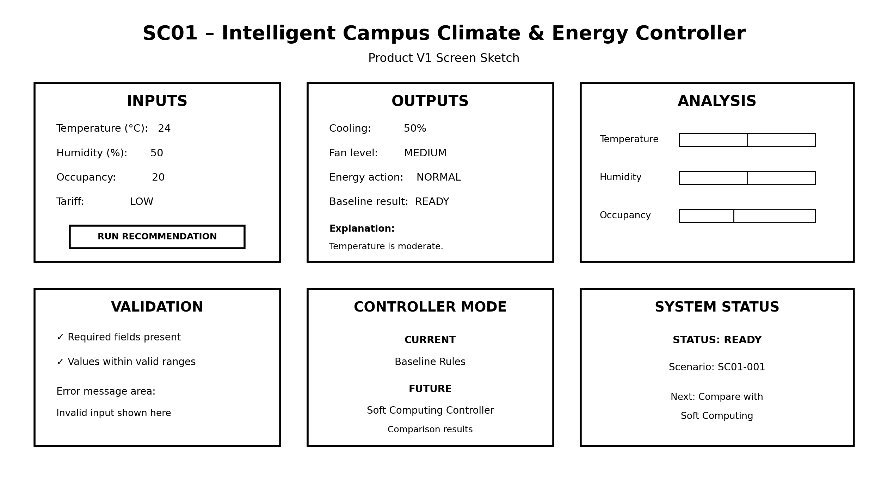

# SC01 – Step 1 Project Contract

## 1. Project Title

**SC01 – Intelligent Campus Climate and Energy Controller**

## 2. Problem Statement

Given room temperature, humidity, occupancy, and electricity tariff, the system should recommend:

* Cooling percentage
* Fan level
* Energy action

The system is intended for a **campus facility manager** who needs simple recommendations for managing room climate while considering energy usage.

## 3. Step 1 Objective

Step 1 establishes the project contract, starter data, validation process, baseline controller, test cases, and Product V1 design.

The baseline is intentionally simple and deterministic. It will later provide a reference point for comparison with Soft Computing approaches such as fuzzy logic.

## 4. Input Variables

| Field             | Meaning                     | Type     | Initial Valid Range / Values  |
| ----------------- | --------------------------- | -------- | ----------------------------- |
| `scenario_id`     | Unique scenario name        | Text     | Unique value                  |
| `temperature_c`   | Room temperature            | Number   | 18–45°C for starter scenarios |
| `humidity_pct`    | Relative humidity           | Number   | 20–100%                       |
| `occupancy_count` | Number of people in room    | Integer  | 0 to chosen room capacity     |
| `tariff_level`    | Electricity tariff category | Category | `low`, `medium`, `high`       |

## 5. Output Variables

| Field           | Meaning                   | Values                         |
| --------------- | ------------------------- | ------------------------------ |
| `cooling_pct`   | Recommended cooling level | 0–100                          |
| `fan_level`     | Recommended fan level     | `off`, `low`, `medium`, `high` |
| `energy_action` | Energy recommendation     | `normal`, `save`, `avoid_peak` |

## 6. Data Assumptions

The following assumptions are used for Step 1:

1. Temperature is measured in degrees Celsius.
2. Humidity is represented as relative humidity percentage.
3. Occupancy is a non-negative integer.
4. Each scenario has a unique `scenario_id`.
5. Tariff level is one of `low`, `medium`, or `high`.
6. The starter dataset is a small fixture for development and validation, not a real campus measurement dataset.
7. Temperature and humidity thresholds used by the baseline are temporary assumptions.
8. The starter dataset contains normal operating examples; later stages will generate a larger scenario dataset.

## 7. Starter Dataset

The starter dataset is stored at:

`data/sample_input.csv`

It contains 20 starter scenarios covering different combinations of temperature, humidity, occupancy, and tariff.

The dataset is used to test data validation and provide examples for the baseline controller.

## 8. Invalid Test Dataset

An intentionally invalid dataset is stored at:

`data/test/invalid_input.csv`

This file contains a non-numeric temperature value and is expected to fail validation.

This demonstrates that the validation program rejects malformed input rather than silently accepting it.

## 9. Mandatory Step 1 Test Cases

The following five scenarios are required for Step 1:

| Test Case  | Temperature | Humidity | Occupancy | Tariff | Expected Focus                         |
| ---------- | ----------: | -------: | --------: | ------ | -------------------------------------- |
| `SC01-001` |        24°C |      50% |        20 | low    | Comfortable room; low/moderate cooling |
| `SC01-002` |        36°C |      85% |        45 | medium | Hot and humid; strong cooling and fan  |
| `SC01-003` |        38°C |      60% |         0 | high   | Empty room; energy-saving rule         |
| `SC01-004` |        45°C |      70% |        50 | high   | Heat-wave boundary condition           |
| `SC01-005` |        21°C |      90% |        15 | low    | Cool but humid; fan decision           |

These cases are intended to exercise normal, stress, boundary, empty-room, and humidity-related conditions.
### Expected Baseline Outputs

| Test Case | Expected Cooling | Expected Fan Level | Expected Energy Action |
|---|---:|---|---|
| `SC01-001` | 50% | medium | normal |
| `SC01-002` | 90% | high | normal |
| `SC01-003` | 0% | off | avoid_peak |
| `SC01-004` | 90% | medium | avoid_peak |
| `SC01-005` | 10% | medium | normal |

These expected outputs are produced by the numbered baseline rules in this document and are verified by `src/baseline_controller.py`.

## 10. Baseline Controller Rules

The Step 1 baseline uses deterministic rules.

### Rule 1 – Empty Room

If:

`occupancy_count == 0`

then:

* `cooling_pct = 0`
* `fan_level = off`

### Rule 2 – Low Temperature

If the room is occupied and:

`temperature_c < 24`

then:

`cooling_pct = 10`

### Rule 3 – Moderate Temperature

If the room is occupied and:

`24 <= temperature_c <= 30`

then:

`cooling_pct = 50`

### Rule 4 – High Temperature

If the room is occupied and:

`temperature_c > 30`

then:

`cooling_pct = 90`

### Rule 5 – High Humidity

If:

`humidity_pct > 75`

increase the fan level by one band.

### Rule 6 – High Tariff

If:

`tariff_level == high`

then:

`energy_action = avoid_peak`

Otherwise:

`energy_action = normal`

The complete baseline pseudocode is stored in:

`docs/baseline-pseudocode.md`

## 11. Validation Requirements

The validation program is stored at:

`src/validate_data.py`

It must check:

* Required columns
* Missing values
* Numeric fields
* Temperature range
* Humidity range
* Occupancy values
* Valid tariff categories
* Duplicate scenario IDs

A valid dataset must produce:

`STEP 1 DATA CHECK PASSED`

An intentionally invalid dataset must produce a clear validation error.

## 12. Product V1 Screen Requirements

The Product V1 screen sketch must contain:

### Inputs

* Temperature
* Humidity
* Occupancy
* Tariff level

### Action

A clear button such as:

**Run Recommendation**

### Outputs

* Cooling percentage
* Fan level
* Energy action
* Baseline result
* Short explanation

### Validation

The screen should display a clear error when an invalid input is entered.

### Explanation / Visual Element

The screen should contain at least one simple explanation or chart that helps the facility manager understand the recommendation.

### Baseline vs Future Soft Computing

The interface should make it possible to distinguish the current baseline result from the future Soft Computing result.

The final sketch will be stored at:

`docs/product-v1-sketch.png`

### Product V1 Screen Sketch

## 13. Project Team

* **Vansh Sharma**
* **Manshi Tiwari**
* **Lakshya Sharma**
* **Akash Dubey**

## 14. Team Git Workflow

Each team member should contribute a meaningful project change.

The workflow is:

1. Select an assigned task.
2. Make the required change.
3. Test the change.
4. Review the result.
5. Commit with a clear commit message.
6. Push the commit to the shared repository.

Git history will be used as evidence of team contributions.

## 15. Step 1 Deliverables

Before Step 1 is considered complete, the repository should contain:

* [x] Git repository
* [x] Starter dataset
* [x] Data validation program
* [x] Invalid test dataset
* [x] Baseline pseudocode
* [x] README
* [x] Step 1 project contract
* [x] `data/README.md`
* [x] Five test cases demonstrated
* [x] Product V1 screen sketch
* [x] Validation evidence
* [x] Step 1 demonstration evidence
* [ ] Meaningful Git contribution from each team member

## 16. Step 1 Completion Criteria

Step 1 is complete when:

1. The project contract is documented.
2. Starter data is present and validated.
3. Invalid data is correctly rejected.
4. The baseline rules are documented.
5. The five mandatory test cases are demonstrated.
6. The Product V1 screen sketch is available.
7. Evidence of validation and testing is recorded.
8. Team contributions are visible in Git history.
9. The repository is ready for the faculty Step 1 demonstration.

## 17. Future Work

After Step 1 approval, the project can proceed to the next stage, including:

* Reproducible scenario generation
* Larger datasets
* Baseline controller implementation
* Soft Computing controller development
* Fuzzy logic
* Performance comparison between approaches

The Step 1 baseline should remain available as the reference system for future comparisons.

